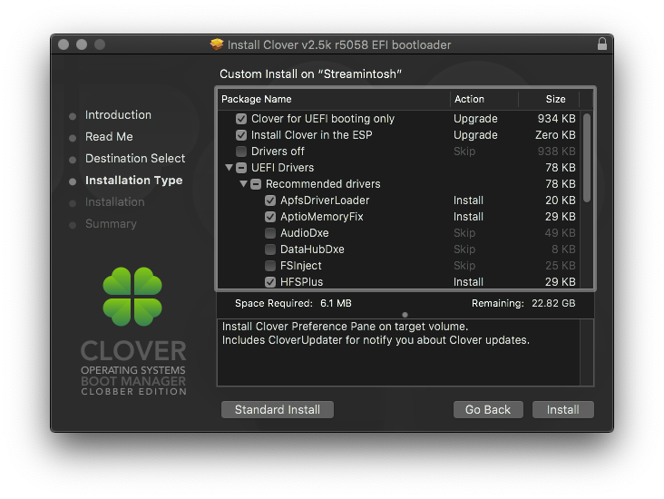

# Clover Setup

## Installing Clover

Fire up your Clover install package. On the 3rd page of the installer **make sure to select your USB as the destination**. We also want to **Customize** the installation - as the defaults are pretty lackluster.

The _usual_ options you want to check in the Customize menu are shown in the following screenshots with an explanation of each after \(**Note**: any non-Z370 300-series board will need _EmuVariableUefi-64_ as well - it is located under _UEFI Drivers -&gt; Additional drivers_ in current Clover packages\):

* _Install Clover for UEFI booting only_
* _Install Clover to the ESP_
* Under _UEFI Drivers:_
  * _AptioMemoryFix_ \(the new hotness that includes NVRAM fixes, as well as better memory management\)
    * **Note:** You can use _OsxAptioFix3Drv_ located in _UEFI Drivers -&gt; Memory fix drivers_ if using the official Clover installer from SourceForge.  Optionally, you can download the final release of _AptioMemoryFix_ from [here](https://github.com/acidanthera/AptioFixPkg/releases) 
  * _HFSPlus_ \(or _VBoxHfs_\) - one of these is required for Clover to see and boot HFS+ volumes.  If you see the option to enable it in the installer, make sure it's selected - if you don't see it in the installer, verify that one of them exists in your Clover installs efi drivers folder
  * _ApfsDriverLoader_ - \(Available in Dids' Clover builds - or [here](https://github.com/acidanthera/ApfsSupportPkg/releases)\) this allows Clover to see and boot from APFS volumes by loading _apfs.efi_ from the ApfsContainer located on block device \(if using _AptioMemoryFix_ as well, ensure you have R21 or newer\)

_**That's it.**_

If you don't need FileVault, and are setting up a standard UEFI installation, these are the only entries you should need.  You may find more than the above selected in the _UEFI Drivers_ section and subsections - feel free to deselect any not listed.  There are some that can even cause conflicts with other settings/kexts \(Like [_SMCHelper-64.efi_](https://github.com/acidanthera/VirtualSMC/blob/master/Docs/FAQ.md)\), so it's a good idea to run as lean as possible here.

_Where do they install?_

If you need to manually make changes to the efi drivers on your Clover installation \(or just verify that you have what you need\), their location may differ depending on your Clover version.

* Clover version up to r4982: `EFI -> CLOVER -> drivers64UEFI` 
* Clover versions r4983 to r4985: `EFI -> CLOVER -> UEFIDrivers` 
  * Will still use `EFI -> CLOVER -> drivers64UEFI` if the above is not found
* Clover versions r4986 to present: `EFI -> CLOVER -> drivers -> UEFI` 
  * Will still use `EFI -> CLOVER -> drivers64UEFI` if the above is not found

## Copying Kexts

Once Clover has been installed, you'll see the EFI partition of your USB on the desktop - we want to navigate to `EFI -> CLOVER -> kexts -> Other` and copy the kexts we downloaded earlier there.  Make sure you unzip the kexts before copying them over.  Any _dSYM_ files can be ignored, we only want the _.kext_ files.

_But what about the 10.xx folders?_

When Clover is looking to inject kexts, the kexts in the _10.xx_ folders are only injected if Clover determines that the folder name matches the booted OS version.  There are very few kexts that are OS version-dependent though, and updating the OS while forgetting to migrate the kexts can leave you in an unbootable state.  The kexts located in the _Other_ folder will inject regardless of the detected OS version.

