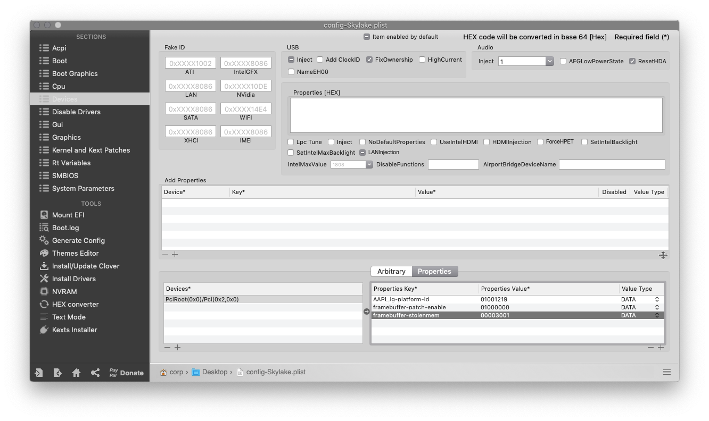

# Haswell

## Starting Points

I like to start with either the stock _config.plist_ that Clover gives you, or with just a blank canvas.  In the next examples, I'll show you how I set things up from scratch; if you start from somewhere else, you may have more things checked/set than I do - but you'll want to follow along with what I do.

I'll also include the raw xml examples too in order to show those that work with a text editor \(as I prefer to\).

## ACPI

The default Clover settings are pretty overdone and can cause some issues.  We'll keep this section fairly minimal, and I'll go through a bit of _why we do that_ for each part as well.

### Raw XML

```markup
    <key>ACPI</key>
    <dict>
        <key>DSDT</key>
        <dict>
            <key>Fixes</key>
            <dict>
                <key>FixHPET</key>
                <true/>
                <key>FixIPIC</key>
                <true/>
                <key>FixRTC</key>
                <true/>
                <key>FixShutdown</key>
                <true/>
                <key>FixTMR</key>
                <true/>
            </dict>
            <key>Patches</key>
            <array>
                <dict>
                    <key>Comment</key>
                    <string>change EHC1 to EH01</string>
                    <key>Disabled</key>
                    <false/>
                    <key>Find</key>
                    <data>
                    RUhDMQ==
                    </data>
                    <key>Replace</key>
                    <data>
                    RUgwMQ==
                    </data>
                </dict>
                <dict>
                    <key>Comment</key>
                    <string>change EHC2 to EH02</string>
                    <key>Disabled</key>
                    <false/>
                    <key>Find</key>
                    <data>
                    RUhDMg==
                    </data>
                    <key>Replace</key>
                    <data>
                    RUgwMg==
                    </data>
                </dict>
                <dict>
                    <key>Comment</key>
                    <string>change SAT0 to SATA</string>
                    <key>Disabled</key>
                    <false/>
                    <key>Find</key>
                    <data>
                    U0FUMA==
                    </data>
                    <key>Replace</key>
                    <data>
                    U0FUQQ==
                    </data>
                </dict>
            </array>
        </dict>
        <key>DropTables</key>
        <array>
            <dict>
                <key>Signature</key>
                <string>DMAR</string>
            </dict>
            <dict>
                <key>Signature</key>
                <string>MATS</string>
            </dict>
        </array>
        <key>FixHeaders</key>
        <true/>
        <key>SSDT</key>
        <dict>
            <key>Generate</key>
            <dict>
                <key>PluginType</key>
                <true/>
            </dict>
        </dict>
    </dict>
```

### Clover Configurator Screenshots




### Explanation

#### Patches:

The first thing we'll go over is the _Patches_ section.  This section allows us to dynamically rename parts of the DSDT via Clover.  Since we're not running a real mac, and macOS is pretty particular with how things are named, we can make non-destructive changes to keep things mac-friendly.  We have three entries here:

* _change EHC1 to EH01 -_ helps avoid a conflict with built-in USB injectors
* _change EHC2 to EH02_ - helps avoid a conflict with built-in USB injectors
* _change SAT0 to SATA_ - for potential SATA compatibility

#### Fixes:

If we look then at the _Fixes_ section, we'll see that we have a few things checked \(there are 2 pages, so I included 2 screenshots\):

* _FixShutdown_ - this can help with some boards that prefer to restart instead of shutdown.  Sometimes it can cause shutdown issues on other boards \(ironic, right?\), so if you have issues shutting down with this enabled, look at disabling it.
* The remaining fixes help avoid IRQ conflicts and etc, and are not known to cause issues.  They may not be necessary for all hardware, but do not negatively impact anything if applied.

#### Drop Tables

We touched in gently on DSDT with our _Patches_ section - and this is a a bit of an extension of that.  SSDT is like a sub-section of DSDT.  The _Drop Tables_ section allows us to omit certain SSDT tables from loading \(as I mentioned before, mac and PC DSDT is different, and macOS can be rather picky\).  The two that I've added are as follows:

* _DMAR_ - this prevents some issues with Vt-d; which is PCI passthrough for VMs, and not very functional \(if at all?\) on Hackintoshes.
* _MATS_ - with High Sierra on up this table is parsed, and can sometimes contain unprintable characters that can lead to a kernel panic.

#### FixHeaders and PluginType

The only other things we've done on this page are enable these two checkboxes.

* _FixHeaders_ - this is just a double-up of our _MATS_ table dropping.  This checkbox tells Clover to sanitize headers to avoid kernel panics related to unprintable characters.
* _PluginType_ - this injects some DSDT data to get _X86PlatformPlugin_ to load - giving us a leg-up on native CPU power management. This setting only works on Haswell and newer CPUs though.

## Boot

We don't need to do _too much_ here, but we'll tweak a few things.

### Raw XML

```markup
	<key>Boot</key>
	<dict>
		<key>Arguments</key>
		<string>keepsyms=1 dart=0 debug=0x100 shikigva=56 -v</string>
		<key>DefaultVolume</key>
		<string>LastBootedVolume</string>
		<key>Timeout</key>
		<integer>5</integer>
	</dict>
```

### Clover Configurator Screenshots


### Explanation

#### Arguments:

We have a few boot args set here:

* `-v` - this enables verbose mode, which shows all the _behind-the-scenes_ text that scrolls by as you're booting instead of the Apple logo and progress bar.  It's invaluable to any Hackintosher, as it gives you an inside look at the boot process, and can help you identify issues, problem kexts, etc.
* `dart=0` - this is just an extra layer of protection against Vt-d issues.
* `debug=0x100` - this prevents a reboot on a kernel panic.  That way you can \(hopefully\) glean some useful info and follow the breadcrumbs to get past the issues.
* `keepsyms=1` - this is a companion setting to `debug=0x100` that tells the OS to also print the symbols on a kernel panic.   That can give some more helpful insight as to what's causing the panic itself.
* `shikigva=40` - this flag is specific to the iGPU.  It enables a few _Shiki_ settings that do the following \(found [_here_](https://github.com/acidanthera/WhateverGreen/blob/master/WhateverGreen/kern_shiki.hpp#L35-L74)\):
  * `8 - AddExecutableWhitelist` - ensures that processes in the whitelist are patched.
  * `32 - ReplaceBoardID` - replaces board-id used by AppleGVA by a different board-id.

#### DefaultBootVolume and Timeout

These are the only other settings I've updated in this section.

* _DefaultBootVolume_ - this uses NVRAM to remember which volume was last booted by Clover, and auto-select that at the next boot.
* _Timeout_ - this is the number of seconds before the _DefaultBootVolume_ auto-boots.  You can set this to `-1` to avoid all timeout, or to `0` to skip the GUI entirely.  If set to `0`, you can press any keys at boot to get the GUI to show back up in case of issues.

## Boot Graphics

Nothing here - just the stock settings.  You could adjust this if Clover's scaling needs changes, but I don't mess with it.

## Cpu

Again, nothing here gets changed in most setups I've worked with.

## Devices

We'll handle some slick property injection for _WhateverGreen_ here, and do some basic audio setup.

### Raw XML

```markup
	<key>Devices</key>
	<dict>
		<key>Audio</key>
		<dict>
			<key>Inject</key>
			<integer>1</integer>
			<key>ResetHDA</key>
			<true/>
		</dict>
		<key>Properties</key>
		<dict>
			<key>PciRoot(0x0)/Pci(0x2,0x0)</key>
			<dict>
				<key>AAPL,ig-platform-id</key>
				<data>
				AwAiDQ==
				</data>
			</dict>
		</dict>
		<key>USB</key>
		<dict>
			<key>FixOwnership</key>
			<true/>
		</dict>
	</dict>
```

### Clover Configurator Screenshots


### Explanation

#### Fake ID

This section remains empty for our example setup.  In the past, almost-supported iGPUs \(like the HD 4400\) would get faked to a supported iGPU here, but we'll be using the cleaner Properties section for this.

#### USB

Under this section, we ensure that _Inject_ and _FixOwnership_ are selected to avoid issues with hanging at a half-printed line somewhere around the `Enabling Legacy Matching` verbose line.  You can also get past that by enabling _XHCI Hand Off_ in BIOS.

#### Audio

Here we set our audio to inject _Layout 1_ - this may or may not be compatible with your codec, but you can check on [_AppleALC's Supported Codec Page_](https://github.com/acidanthera/AppleALC/wiki/Supported-codecs).

We also enabled _ResetHDA_ which puts the codec back in a neutral state between OS reboots.  This prevents some issues with no audio after booting to another OS and then back.

#### Properties

This section is setup via Headkaze's [_Intel Framebuffer Patching Guide_](https://www.insanelymac.com/forum/topic/334899-intel-framebuffer-patching-using-whatevergreen/?tab=comments#comment-2626271) and applies only one actual property to begin, which is the _ig-platform-id_.  The way we get the proper value for this is to look at the ig-platform-id we intend to use, then swap the pairs of hex bytes.

If we think of our ig-plat as `0xAABBCCDD`, our swapped version would look like `0xDDCCBBAA`.

The two ig-platform-id's we use are as follows:

* `0x0D220003` 
  * `0300220D` when hex-swapped
  * `AwAiDQ==` when the hex-swapped version is converted to base64
* `0x04120004`
  * `04001204` when hex-swapped
  * `BAASBA==` when the hex-swapped version is converted to base64


